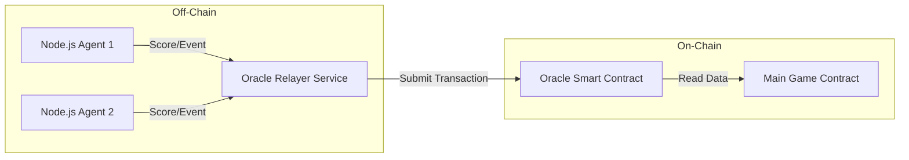

# Oracle Architecture for Match Data

## Overview
This document outlines the architecture for the Oracle system designed to feed live match details into the main PulseBet smart contract. 

Due to the unavailability of free public APIs for live cricket scores, we are simulating the external data sources using custom Node.js programs. This allows us to test and develop the smart contract's reaction to match events without relying on paid third-party services initially.

## Architecture

The system consists of three main layers:
1.  **Data Source Layer (Mock)**: Node.js programs mimicking external cricket APIs.
2.  **Oracle Layer (Hybrid)**:
    *   **Off-Chain Relayer**: A Node.js service that fetches data from sources.
    *   **On-Chain Oracle Contract**: A dedicated smart contract that verifies and stores the match data.
3.  **Consumer Layer**: The Main PulseBet Smart Contract that consumes data from the Oracle Contract.



## Detailed Components

### 1. Mock Data Generators (Node.js Programs)
We will deploy two independent Node.js scripts to act as our "APIs".
*   **Role**: Mimic real-world data providers (like Cricbuzz or ESPNcricinfo).
*   **Behavior**: These scripts will randomly or programmatically generate match events.
    *   *Events*: `1 Run`, `4 Runs`, `6 Runs`, `OUT`, `No Ball`, etc.
*   **Output**: They will expose an endpoint (HTTP/WebSocket) for the Relayer to read.

### 2. The Oracle Layer

#### A. Oracle Relayer Service (Off-Chain Node.js)
*   **Role**: The active "fetcher".
*   **Logic**:
    *   Listens to the Mock Data Generators.
    *   **Aggregation**: Receives scores from agents. (e.g., Agent 1: "Six", Agent 2: "Six" -> Consensus: "Six").
    *   **Submission**: Signs a transaction and calls the `update_match_data` function on the **Oracle Smart Contract**.

#### B. Oracle Smart Contract (On-Chain)
*   **Role**: The "Trusted Source of Truth" on the blockchain.
*   **Logic**:
    *   **Storage**: Stores the latest match state (Score, Overs, Wickets) in its contract state.
    *   **Security**: Only allows the authorized "Oracle Relayer" address to update the data.
    *   **Interface**: Exposes a `get_latest_score()` function that other contracts can call.

### 3. Main Game Contract
*   **Role**: The consumer.
*   **Logic**:
    *   Calls `OracleContract.get_latest_score()` (or implements a callback interface).
    *   Uses the trusted data to settle bets.
    *   Decoupling: It doesn't care *how* the data got there, it just trusts the Oracle Contract.

## design Rationale & FAQ

### Q: Can the Smart Contract directly call the API?
**No.** Blockchains are deterministic and isolated systems.
*   A smart contract cannot make HTTP requests (like `fetch` or `axios`).
*   If it did, every node in the network would get a slightly different result (time latency, API rate limits), causing the blockchain to fail consensus.
*   **Therefore, an off-chain server (the Oracle Node) is absolutely required to "bring" the data in.**

### Q: Does the Oracle *need* to be a Smart Contract?
**Technically, no.** The "Oracle" is primarily the **off-chain Node.js server**.
You have two implementation choices:

#### Option A: Direct Push (Simplest)
*   **Flow**: `Node.js Server` -> calls `MainContract.updateScore(6)`.
*   **Pros**: Only one smart contract to write.
*   **Cons**: The Main Contract gets cluttered with data-handling logic.

#### Option B: Dedicated Oracle Contract (Recommended)
*   **Flow**: `Node.js Server` -> calls `OracleContract.updateMatchData(6)` -> `MainContract` reads from `OracleContract`.
*   **Pros**:
    *   **separation of Concerns**: The Main Contract focuses on Betting/Game logic, while the Oracle Contract focuses on Data/Trust logic.
    *   **Reusability**: Other developers could build *different* games using your same Oracle Contract for scores.

*For this project, we will likely start with **Option A (Direct Push)** for simplicity, or **Option B** if we want to show off a clean architecture.*

## Workflow (Revised for Direct/Hybrid)

1.  **Generation**:
    *   `Node App 1` & `Node App 2` generate an event.
2.  **Relaying**:
    *   The **Oracle Server (Node.js)** detects the data.
3.  **On-Chain Execution**:
    *   The Oracle Server signs a transaction to the **PulseBet Contract**.
    *   Function: `update_score(match_id, new_score, signature)`.
4.  **Game Logic**:
    *   The contract verifies the sender is the authorized Oracle Wallet.
    *   It updates the state and settles bets immediately.

## Technical Demo: Node.js to Rust Interaction

How does a JavaScript server talk to a Rust contract on Linera?
**Answer: GraphQL Mutations.**

### 1. Rust Smart Contract (`src/contract.rs`)
In your Linera contract, you define an `Operation` that the Oracle can trigger.

```rust
use serde::{Deserialize, Serialize};
use linera_sdk::views::View;

// The "API" of your contract
#[derive(Debug, Deserialize, Serialize)]
pub enum Operation {
    // This is the function the Oracle will call
    UpdateScore {
        match_id: u64,
        score: u32,
        is_wicket: bool,
    },
}

#[async_trait]
impl Contract for PulseBetContract {
    // ... other types ...

    async fn execute_operation(
        &mut self,
        _context: &OperationContext,
        operation: Operation,
    ) -> Result<ExecutionResult<Message>, Error> {
        match operation {
            Operation::UpdateScore { match_id, score, is_wicket } => {
                // 1. Verify Sender (Security Check)
                // ensure_authenticated(_context)?; 
                
                // 2. Update State
                self.matches.get_mut_or_default(&match_id).await.unwrap().current_score = score;
                
                // 3. Save
                Ok(ExecutionResult::default())
            }
        }
    }
}
```

### 2. Node.js Oracle Server (`oracle.js`)
The Node.js server acts as a standard HTTP client. It sends a **GraphQL Mutation** to the local Linera Node (or a remote Validator).

```javascript
/* 
 * Prerequisites: 
 * 1. A running Linera Service (./linera-service)
 * 2. The Chain ID and Application ID of your deployed contract
 */

const APP_ID = "e476187f6dd94..."; // Your Contract's ID
const CHAIN_ID = "e476187f6dd94..."; // The Chain we are interacting with
const NODE_URL = "http://localhost:8080"; // REPLACE with Testnet URL (e.g., https://testnet-archway.linera.io) or Local Node

async function sendScoreToContract(matchId, score, isWicket) {
    const query = `
        mutation {
            executeOperation(
                applicationId: "${APP_ID}",
                operation: {
                    UpdateScore: {
                        match_id: ${matchId},
                        score: ${score},
                        is_wicket: ${isWicket}
                    }
                }
            )
        }
    `;

    try {
        const response = await fetch(NODE_URL + "/chains/" + CHAIN_ID + "/graphql", {
            method: "POST",
            headers: { "Content-Type": "application/json" },
            body: JSON.stringify({ query: query })
        });

        const result = await response.json();
        console.log("Batting Score Updated:", result);
    } catch (error) {
        console.error("Failed to update score:", error);
    }
}

// Mimic a "Six" being hit in Match #101
sendScoreToContract(101, 6, false);
```
